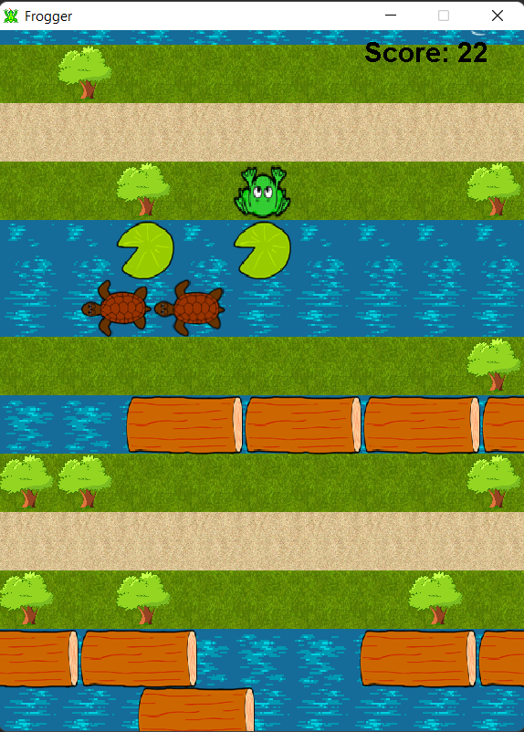

# PA1- Frogger (JAVA)

Semester Project for the Advanced Programming Course (CIIC 4010) - Spring 2019\
Partner: Jean C. Jimenez

This project is a recreation of the game Frogger, a base code was given to us and we implemented different features according to our knowledge at the moment of the class. Some of this features included implementing the game over state and all the actions that trigger this, setting bounderies of the game, movement of the frog and spawning random obstacles(trees, turtlesm and trunks).

